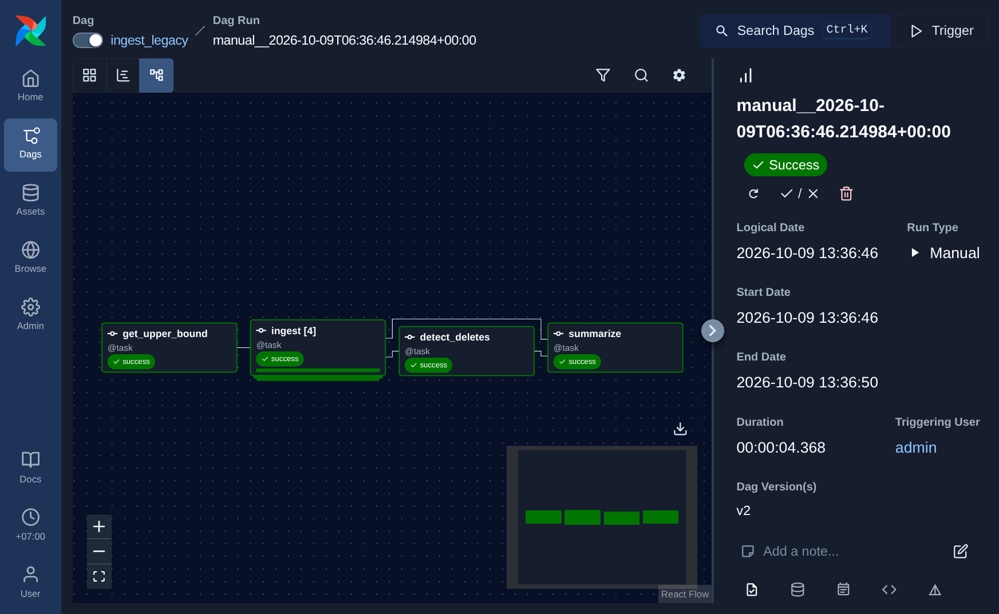

# Bằng chứng tiêu chí Tuần 2

Các lần chạy dưới đây được trigger từ UI Airflow tại `http://localhost:8080`,
không dùng `make ingest-all`. Môi trường Docker Compose local, ngày
2026-10-09 (giờ hiển thị Airflow: `+07:00`).

## Trình tự và kết quả

| Bước | Airflow run ID | Kết quả |
|---|---|---|
| 1. Reset raw và watermark | — | Bốn watermark về `0`; bốn bảng raw rỗng. |
| 2. Tải lần đầu | `manual__2026-10-09T06:34:32.049290+00:00` | customers 2.009, products 60, orders 20.006, order_items 60.220. |
| 3. Không có thay đổi | `manual__2026-10-09T06:36:12.812375+00:00` | Cả bốn bảng tải 0 dòng. |
| 4. Giả lập thay đổi nguồn | — | Sửa 5 khách, thêm 3 khách, chuyển 4 đơn, thêm 2 đơn với 5 chi tiết, xóa cứng 3 chi tiết. |
| 5. Nạp incremental | `manual__2026-10-09T06:36:46.214984+00:00` | customers 8, orders 9, order_items 5, products 0; `detect_deletes` đánh dấu 3 order_items. |
| 6. Hạ watermark và replay | `manual__2026-10-09T06:37:15.181201+00:00` | Nạp lại đúng 8 customers, 9 orders, 5 order_items; raw không tăng thêm dòng. |

Raw ban đầu có 2.009 customers và 20.006 orders thay vì đúng 2.000/20.000
do các lượt thử trước đó đã thêm dữ liệu vào SQL Server nguồn. Lần full load
đã tải toàn bộ dữ liệu nguồn hiện có.

Run ID lần 1–4 đều có trạng thái `success`; mỗi run hoàn tất các task ingest,
`detect_deletes` và `summarize`.

## Ingest log

Kết quả tương ứng với truy vấn `ORDER BY id DESC LIMIT 8` sau lần chạy thứ tư:

| Run (ngắn) | Bảng | from_rowversion | to_rowversion | row_count | loaded_at (UTC) |
|---|---|---:|---:|---:|---|
| `06:37:15` | order_items | 200062 | 200095 | 5 | 2026-10-09 06:37:17.216412+00 |
| `06:37:15` | customers | 200062 | 200095 | 8 | 2026-10-09 06:37:17.209786+00 |
| `06:37:15` | orders | 200062 | 200095 | 9 | 2026-10-09 06:37:17.203903+00 |
| `06:37:15` | products | 200095 | 200095 | 0 | 2026-10-09 06:37:17.211645+00 |
| `06:36:46` | order_items | 200062 | 200095 | 5 | 2026-10-09 06:36:48.272041+00 |
| `06:36:46` | orders | 200062 | 200095 | 9 | 2026-10-09 06:36:48.247368+00 |
| `06:36:46` | customers | 200062 | 200095 | 8 | 2026-10-09 06:36:48.217658+00 |
| `06:36:46` | products | 200062 | 200095 | 0 | 2026-10-09 06:36:48.217862+00 |

Lệnh hạ watermark được giới hạn ở run thứ ba và chỉ các bảng có
`row_count > 0`. Bộ lọc `run_id` là cần thiết: nếu chạy truy vấn không lọc run
trong lịch sử ingest, bảng products có thể khớp một lần full load cũ và bị
backfill ngoài ý muốn.

## Raw so với nguồn sau lần chạy thứ tư

| Bảng | Nguồn SQL Server | Raw Postgres | Tombstone |
|---|---:|---:|---:|
| customers | 2.012 | 2.012 | 0 |
| orders | 20.008 | 20.008 | 0 |
| order_items | 60.222 | 60.225 | 3 |

Raw `order_items` nhiều hơn nguồn đúng 3 dòng vì nguồn đã xóa cứng ba dòng;
`detect_deletes` giữ chúng trong raw và gắn `_deleted_at`. So sánh số raw trước
và sau replay cho thấy upsert không tạo bản ghi trùng:

| Bảng | Raw sau lần 3 | Raw sau lần 4 |
|---|---:|---:|
| customers | 2.012 | 2.012 |
| orders | 20.008 | 20.008 |
| order_items | 60.225 | 60.225 |

## Airflow Graph view



Run ID: `manual__2026-10-09T06:36:46.214984+00:00`.

## Truy vấn dùng để tái kiểm tra

```sql
SELECT run_id, table_name, from_rowversion, to_rowversion, row_count, loaded_at
FROM etl.ingest_log
ORDER BY id DESC
LIMIT 8;

SELECT 'customers' t, count(*) total,
       count(*) FILTER (WHERE _deleted_at IS NOT NULL) deleted
FROM raw.customers
UNION ALL
SELECT 'orders', count(*), count(*) FILTER (WHERE _deleted_at IS NOT NULL)
FROM raw.orders
UNION ALL
SELECT 'order_items', count(*), count(*) FILTER (WHERE _deleted_at IS NOT NULL)
FROM raw.order_items;
```
